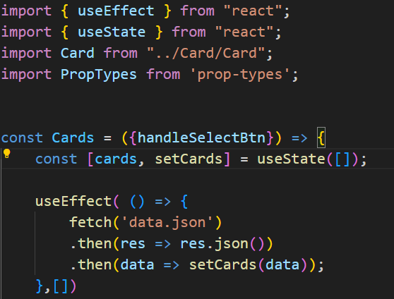
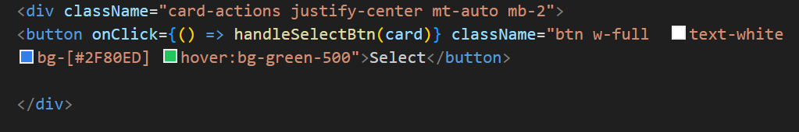
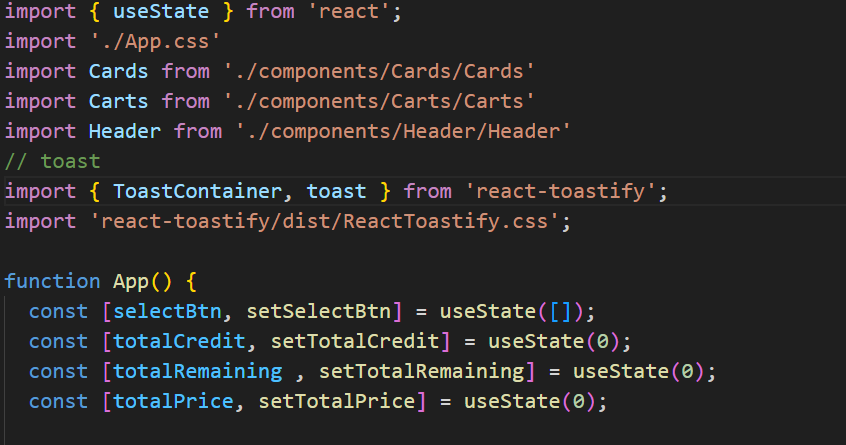

# Interactive React Webpage - "Course Registration": Explore, Select courses and Calculate credit hours and Total costs!:books:

------------

**"Course Registration"**, an interactive React project where users can explore a variety of digital technology, IT, programming related courses. Here users will select the course as per their wish and at the same time they will see an overview of the course list, total credit hours and total price as per their selected course. In fact there is a 20 hour credit limit for each user so when a user exceeds the credit hour limit they will be notified by a toast notification.

-------------

## Project Features: :star: 

- ##### Course Catalog: 
 This project creates an interactive user friendly interface where users can explore as well as select courses as per their wish. The catalog displaying each course's information like course thumbnail, title of the course, description, price and credit hours. There is also a "Select" button to purchase the course. 
 
 - ##### Credit hours limit and toast notification:
 The project has set a limit of 20 credit hours for each user to ensure they do not exceed their course load capacity. This project also implements notification system using toast notifications. When a user selects the same course that he has already booked, he will get a toast notification, which says – ***“Already Booked”***. At the same time when a user exceeds the limit of 20 credit hours he/she will again get a toast notification, which says- ***"Your course's credit hours limit  exceeded"***.
 

 - ##### User get an overview of the course he/she has selected: 
 In this project, after selecting required courses, the user gets an overview of the selected courses, including course titles, total credit hours, total price as well as he/she will also get to know how much credit hours remaining from 20 credit hours.

 

------------

## How I managed the state in my assignment project : :magic_wand:

**"useState"** is a hook, introduced in React, that allows functional components to manage and update their state.

If we want to use useState then we have to import it from the React library. We can declare a state variable using useState fnction and passing an initial value as an argument. And it returns an array with two elements- the ***current state*** value and a ***set function*** to update it. 

In this project, multiple time useState hook has used. In that case , each time when function components was needed to manage or update the state, useState hook has used.

Accoriding to the codes written above we can see that, useState hook is used to manage and update states. We know that the useEffect Hook allows us to perform side effects in our components. Some examples of side effects are: fetching data, directly updating the DOM. 
Here, useEffect is used to handle fetched data. To manage those fetched data and also changes of these data useState hook is used. 

According to the code shown above, here in **useState**, we pass an *empty array* as an initial by default value. And it returns an arrayof object ***cards*** that represent current state  and ***setCards*** that is used to update the state.

-----

Here we can see that, we have added onCLick function ***handleSelectBtn*** into the button. When the button is clicked, then the selected course's title, total credit will be shown in the another components. So in that component, the state will be changed. In that case, we use useState hooks to handle the updating states that are shown below-

According to the code shown above, we  used **useState** to multiple time to handle and manage different states. After the button clicked inside the handleSelectBtn we use **setSelectBtn** function and passed the current state to update the state. 

In this project, after clicking the button as we want to show the total credit hours, total remaining credit and also total price of the selected courses. In that case, it is obvious that out states will be changed for price , credit and remaining. That's why we have to useState for each of them. 

when we used useState for managing total credit, totalRemaing and total price, we pass 0 as initial argument. And these useState hook function returns an array with two elements - a current value and a function to set that current state value.

-----

We know that, before the introduction of hooks, managing state in functional components was not straightforward, as functional components themselves don't have a built-in way to store and update state. useState provides a simple and convenient way to do this.

